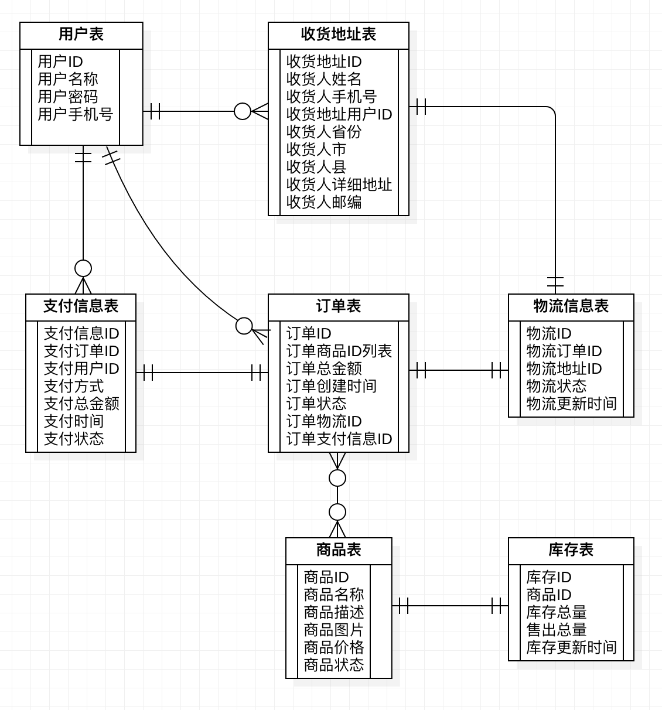

# 电商交易场景描述

## 1、下单流程描述

> 当前基于以下假设：商品信息不变、价格不变

* 用户选择**商品**后，填入**地址**信息，产生**未支付**状态的订单。

* 用户**支付**订单后，订单进入**待确认**状态
* 卖方（后台管理）**确认订单**后订单进入**待发货**状态
* 卖方**发货并填入物流信息**后，订单进入**已发货**状态
* 物流送达后，用户**确认送达**，订单进入**已完成**状态

## 2、实体描述

### 用户实体（users）

(用户ID，用户名称，用户密码，用户手机号)

### 收货地址实体（addresses）

(收货地址ID，收货地址用户ID，收货人姓名，收货人手机号，收货人省份，收货人市，收货人县，收货详细地址)

### 商品实体（goods）

(商品ID，商品名称，商品描述，商品图片，商品价格，商品状态)

### 库存实体（stock)

(库存ID，商品ID，商品总库存，商品卖出数量，库存更新时间)

### 订单实体（orders）

(订单ID，订单商品ID列表，订单总金额，订单创建时间，订单状态，订单物流ID，订单支付信息ID)

### 物流实体（logistics)

(物流ID，订单ID，地址ID，物流状态，物流更新时间)

### 支付信息实体（payments）

(支付信息ID，订单ID，用户ID，支付方式，支付时间，支付总金额)

## 3、ER 图

